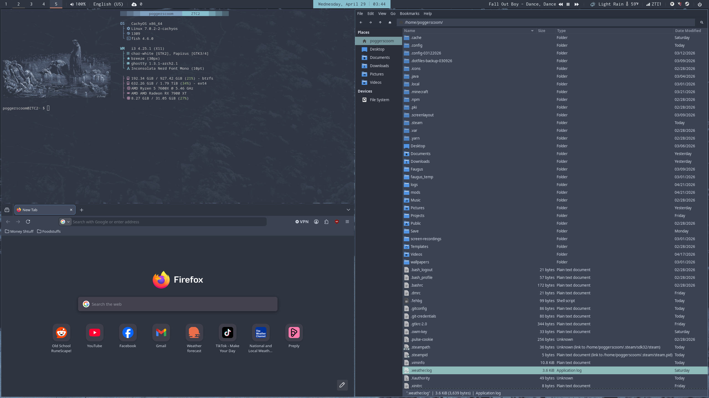

HEAVILY BASED ON THE DOTS HERE: https://github.com/freak532486/nord-rice-dotfiles/tree/main

Simple i3/polybar nord theme. Does what I need it to, and very little of anything else.
This will 100% need to be decently edited to remove a lot of the "me" specific flavorings.

## Programs
I use the following programs to achieve my desktop:
- i3 (Window Manager)
- picom (Composition Manager, for shadows)
- polybar (Status bar)
- dunst (Notification manager)
- Rofi (Launcher and Power menu)

Not in this repository are:
- GTK-Theme (Look for the *Nordic* theme)
- Icon-Theme (Papirus)
- Firefox Theme (Nord)

Fonts:
- Inconsolata LGC Nerd Font Mono
- FontAwesome
- RobotoMono Nerd
- Iosevka Nerd Font
- icomoon-feather

-----

## Dependencies
i3
- xss-lock
- i3lock (currently unused)
- feh
- ghostty (or edit to swap to your terminal emulator of choice)
- thunar (or edit to swap to your file browser of choice)
- rofi
- dunst
- picom
- polybar
- maim
- xclip
- gpu-screen-recorder
- gpu-screen-recorder-ui

polybar
- You will need to edit /polybar/scripts/weather-plugin.sh line 107 to change to your city.
- You will need to provide your own openweathermap api key (they're free!) and put into a file at /home/user/.owm-key
